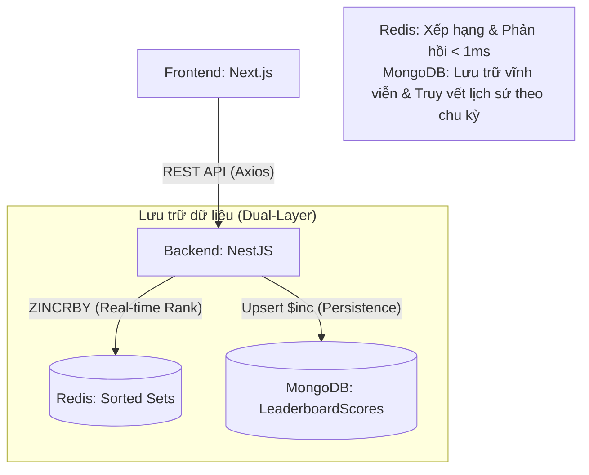

# Hệ Thống Bảng Xếp Hạng (Leaderboard System) - Server Engineer Mini Project

Dự án này triển khai một hệ thống bảng xếp hạng thời gian thực, có khả năng mở rộng cao và đảm bảo an toàn dữ liệu tuyệt đối bằng cơ chế lưu trữ hai lớp (Hybrid Storage), sử dụng NestJS, Redis và MongoDB.

## 🏗 Kiến trúc hệ thống (Architecture Diagram)



## 🚀 Quyết định thiết kế (Design Decisions)

### 1. Hệ thống lưu trữ hai lớp (Hybrid Storage)
Để giải quyết bài toán cân bằng giữa **Tốc độ** và **An toàn dữ liệu**:
- **Tầng Cache (Redis Sorted Sets):** Sử dụng cấu trúc `ZSET` để tính toán thứ hạng với độ phức tạp $O(\log N)$, đảm bảo hiệu năng ngay cả khi có hàng triệu người chơi.
- **Tầng Bền vững (MongoDB LeaderboardScores):** Mỗi khi điểm số thay đổi, hệ thống thực hiện `findOneAndUpdate` với `upsert: true` vào MongoDB. 
    - **An toàn:** Đảm bảo không mất dữ liệu nếu Redis bị sự cố.
    - **Truy vết:** Cho phép xem lại lịch sử điểm số của người chơi theo từng Ngày, Tuần hoặc Season cụ thể.

### 2. Tối ưu hóa Database với Compound Index
Trong MongoDB, tôi sử dụng **Compound Index** trên bộ ba khóa `{ playerId, period, identifier }`.
- Đảm bảo tính duy nhất của dữ liệu cho mỗi người chơi trong một chu kỳ cụ thể.
- Tối ưu hóa tốc độ cập nhật điểm số (`$inc`) đạt hiệu năng cao nhất.

### 3. Quy trình phát triển & Triển khai (DevOps)
- **Containerization:** Toàn bộ hệ thống (App, Mongo, Redis) được đóng gói qua Docker Compose.
- **Hot Reload:** Cấu hình Docker Volume giúp đồng bộ mã nguồn tức thì từ máy local vào container, hỗ trợ phát triển nhanh.
- **Validation:** Tích hợp `class-validator` để kiểm soát dữ liệu đầu vào nghiêm ngặt.

## 🤖 Quy trình phát triển với AI (AI-Assisted Development)

Trong dự án này, tôi đã tận dụng **Gemini CLI** như một cộng sự đắc lực để tối ưu hóa quy trình phát triển từ khâu lập kế hoạch đến khi hoàn thiện:

1.  **Phân tích & Lập kế hoạch (Analysis & Planning):** 
    - Tôi bắt đầu bằng việc cung cấp tài liệu yêu cầu (assignment) cho Gemini CLI để phân tích và đề xuất một kế hoạch thực hiện chi tiết. 
    - Dựa trên những hình dung cá nhân về các module cần thiết (`Players`, `Seasons`, `Leaderboard`), tôi đã cùng AI thảo luận và điều chỉnh kế hoạch nhiều lần để đảm bảo tính khả thi và bám sát đề bài.
2.  **Triển khai cuốn chiếu (Iterative Implementation):** 
    - Tôi thực hiện dự án theo từng giai đoạn của kế hoạch đã thống nhất. 
    - Mỗi module sau khi hoàn thành đều được kiểm tra kỹ lưỡng (Unit Test/E2E) trước khi chuyển sang bước tiếp theo, đảm bảo tính ổn định xuyên suốt của toàn bộ hệ thống.
3.  **Tạo dữ liệu & Kiểm thử (Mock Data & Testing):** 
    - Sau khi xây dựng xong các module service, tôi phối hợp với AI để tạo mock data thực tế và thực hiện các bài kiểm thử hiệu năng. 
    - Các lỗi phát sinh trong quá trình phát triển được phân tích và xử lý tuần tự, triệt để theo đúng yêu cầu đề bài.
4.  **Review & Tối ưu hóa (Code Review & Optimization):** 
    - Khi các tính năng chính đã chạy ổn định, tôi nhờ Gemini CLI đánh giá (review) lại toàn bộ project để tìm kiếm các lỗ hổng tiềm ẩn, tối ưu hóa logic xử lý hoặc đề xuất các tính năng nâng cao (như caching, indexing) trước khi đóng gói sản phẩm.

Cách tiếp cận này giúp tôi rút ngắn thời gian phát triển nhưng vẫn đảm bảo được chất lượng mã nguồn và kiến trúc hệ thống chuẩn mực.

## 🛠 Hướng dẫn cài đặt & Chạy dự án

### Yêu cầu hệ thống
- Docker & Docker Compose
- Node.js v20.14.0 (Nếu chạy local)

### Khởi động nhanh (Quick Start)
Tại thư mục gốc của dự án backend, chạy lệnh duy nhất:
```bash
docker-compose up --build
```
Hệ thống sẽ tự động khởi tạo:
- **Backend:** `http://localhost:3000`
- **Swagger UI:** `http://localhost:3000/api/docs` (Tài liệu API đầy đủ)
- **Frontend UI:** `http://localhost:3001` (Giao diện quản lý & theo dõi thời gian thực)

## 📡 API Endpoints chính

### Players (Quản lý người chơi)
- `POST /players`: Tạo người chơi mới (Khởi tạo đồng thời trong Redis & Mongo).
- `PATCH /players/:id`: Cập nhật thông tin (Đồng bộ tên vào Cache).
- `POST /players/:id/score/increment`: Cộng điểm (Cập nhật đồng thời Redis ZSET & Mongo LeaderboardScore).
- `DELETE /players/:id`: Xóa người chơi hoàn toàn khỏi hệ thống.

### Leaderboard (Bảng xếp hạng)
- `GET /leaderboard/:period`: Lấy Top 100 theo chu kỳ (`daily`, `weekly`, `monthly`, `all`).

## 🧪 Giao diện thử nghiệm (UI Dashboard)
Dự án đi kèm một giao diện **Next.js** chuyên nghiệp giúp:
- Đăng ký và quản lý người chơi trực quan.
- Theo dõi sự thay đổi thứ hạng thời gian thực (Real-time).
- Các nút "Thử nghiệm" (+10, +100 điểm) để kiểm chứng logic xếp hạng ngay lập tức.
